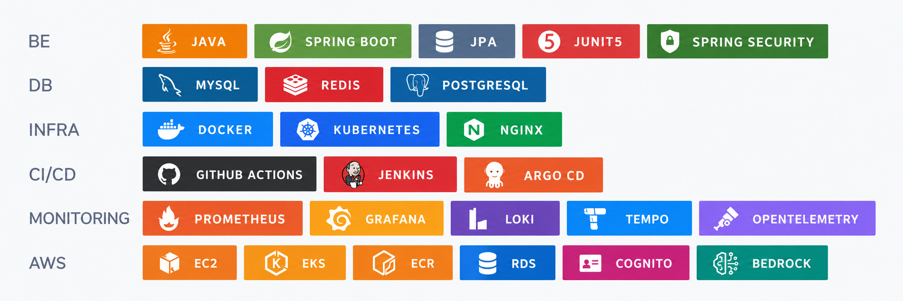

## 사용자의 불편을 기술로 해결하는 개발자 이창헌입니다 😊

### Tech

 

 
 
 

## Development Experience
- 2026.07 ~ 2026.09 | NIPA-AWS AI Security Engineer 수료  
- 2024.10 ~ 2024.11 | 우아한테크코스 7기 프리코스 수료  
- 2023.07 ~ 2024.06 | SSAFY 10기 Java 트랙 수료  

 

## Awards
- NIPA-AWS AI Security Engineer 프로젝트 대상  
- SSAFY 특화 프로젝트 우수상(2위) 수상  
- SSAFY 공통 프로젝트 우수상(3위) 수상  
- 서울문화사 기획 공모전 최우수상  
- 남양유업 대학생 마케팅 공모전 우수상  
 

## License and Certificate
- 2024.12 | 정보처리기사  
- 2023.10 | SQLD  
- 2022.04 | 컴퓨터활용능력2급  
- 2025.05 | TOEIC 845  
- 2025.12 | JLPT N3  
 

## Site
[TISTORY](https://poloopy.tistory.com/)   
 
 
 
 
